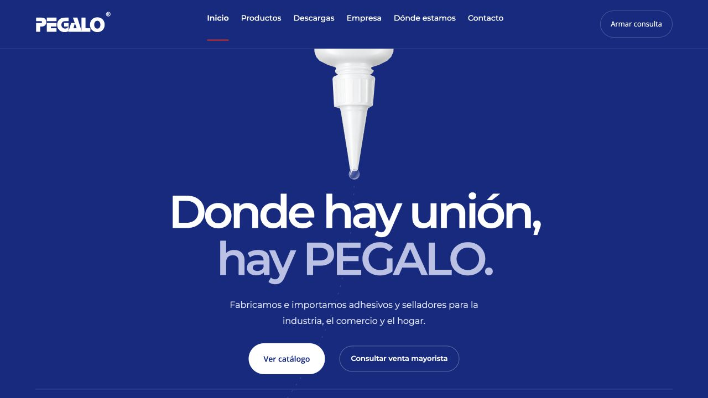
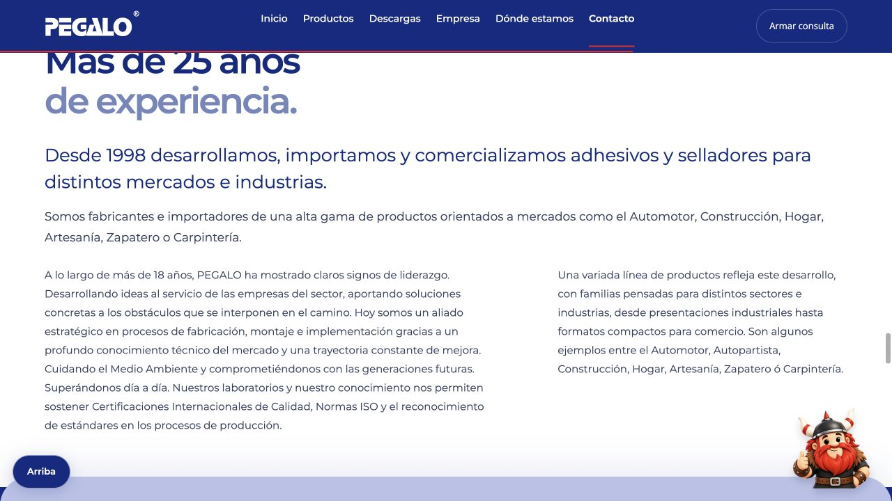
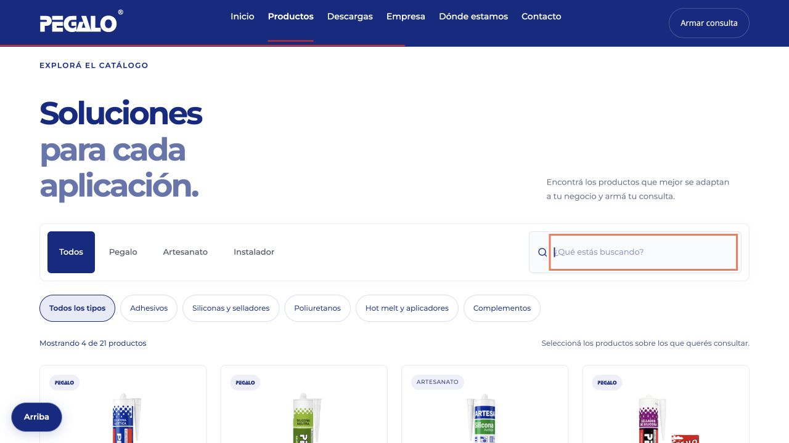
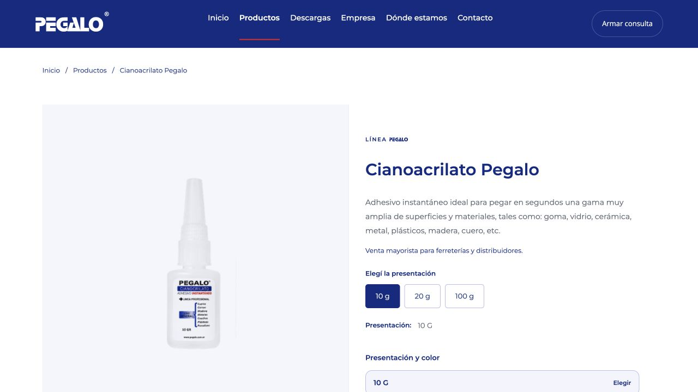
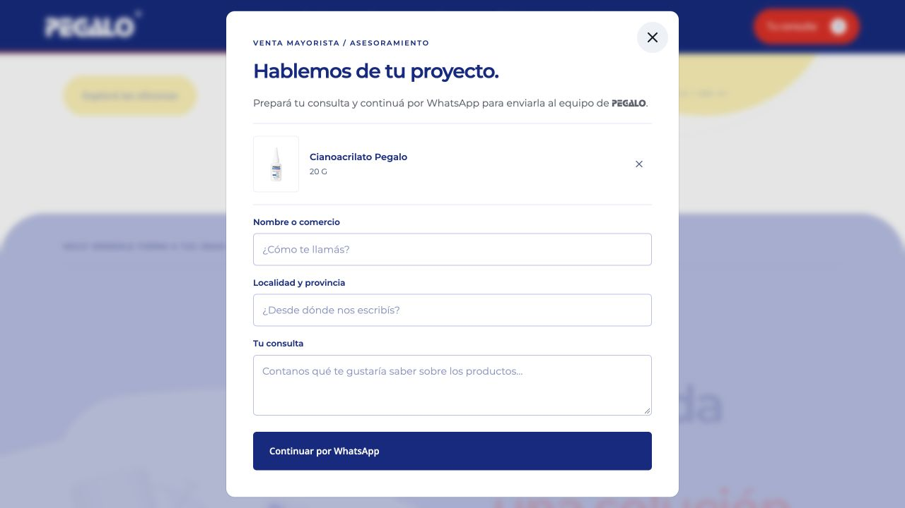
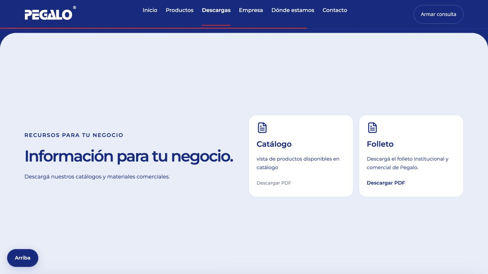
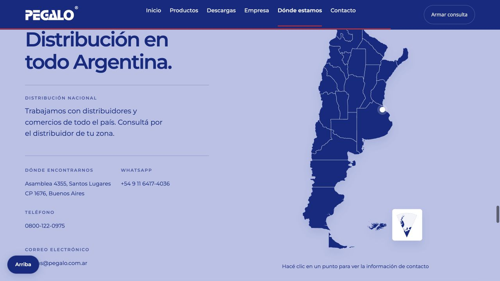
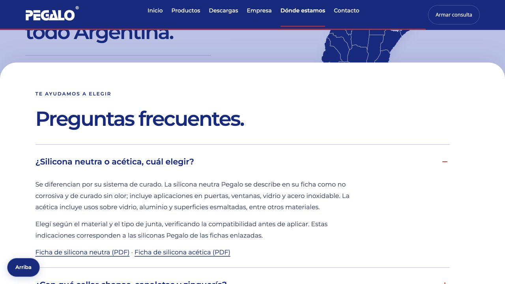
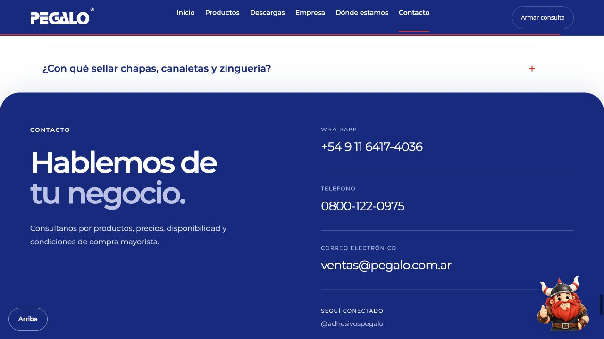
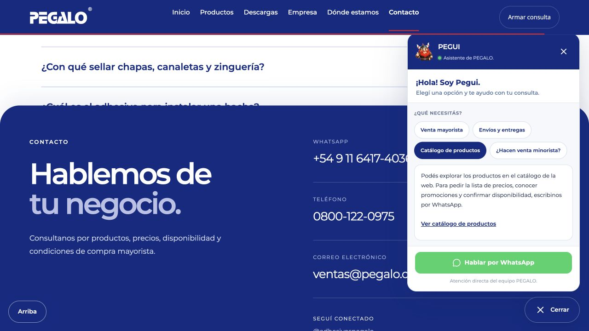

# PEGALO

PEGALO es una empresa argentina dedicada a la comercialización de adhesivos y selladores para el hogar, comercios, profesionales e industrias. Desde 1998 ofrece distintas líneas de productos y atención mayorista en todo el país.

La web presenta la empresa y sus soluciones, permite conocer productos y materiales técnicos, y facilita las consultas al equipo comercial.

## Portada

La portada presenta la marca y la propuesta de PEGALO. Desde aquí podés ir al catálogo o empezar una consulta mayorista.

## La empresa

Esta sección cuenta la trayectoria de la empresa desde 1998 y los mercados a los que acompaña.

## Productos y catálogo

Explorá las líneas de productos, filtrá por tipo o buscá por nombre. Las tarjetas muestran una descripción y las presentaciones disponibles.

## Ficha de producto

Cada ficha amplía la información del producto. Según el producto, podés elegir una presentación, abrir su ficha técnica en PDF y consultar productos relacionados.

## Consulta mayorista

Agregá productos a la consulta y completá tu nombre o comercio, localidad y mensaje. Al elegir **Continuar por WhatsApp**, se prepara el mensaje para que lo revises y decidas si querés enviarlo.

## Descargas

La sección reúne los materiales comerciales publicados, como el folleto institucional. Las fichas técnicas disponibles también se encuentran desde sus productos.

## Dónde estamos

Consultá la información de ubicación y contacto de PEGALO y conocé su cobertura nacional.

## Preguntas frecuentes

Abrí las preguntas para leer orientación sobre productos, aplicaciones y compras mayoristas. Algunas respuestas incluyen enlaces a fichas técnicas.

## Contacto

Encontrá los canales directos de PEGALO: WhatsApp, teléfono y correo electrónico.

## Chat de Pegui

Pegui ofrece accesos rápidos sobre venta mayorista, envíos, catálogo y venta minorista. Muestra orientación inicial y permite continuar la consulta por WhatsApp.
